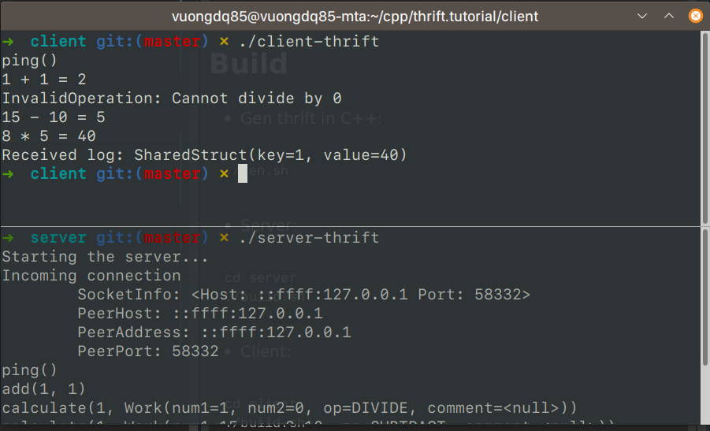

# Apache Thrift
Apache Thrift C++ Example

## Install
* Apache Thrift version 0.13.0
```shell script
sudo apt-get install ant
sudo apt-get install libboost-dev libboost-test-dev libboost-program-options-dev libboost-filesystem-dev libboost-thread-dev libevent-dev automake libtool flex bison pkg-config g++ libssl-dev
http://thrift.apache.org/download
tar -xvf thrift-0.13.0.tar.gz
./bootstrap.sh
./configure
sudo make
sudo make check
sudo make install
thrift -version
```

## Build
* Gen thrift in C++:
```shell script
./gen.sh
```

* Server:
```shell script
cd server
./build.sh
```

* Client:
```shell script
cd client
./build.sh
```

## Result
